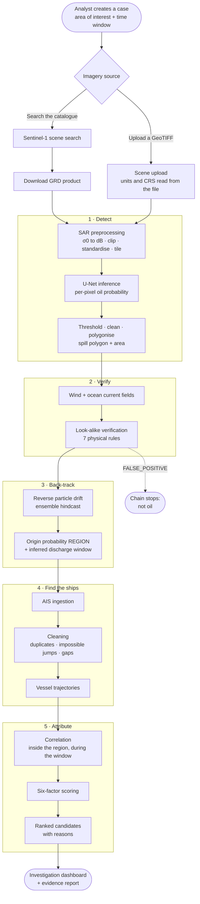
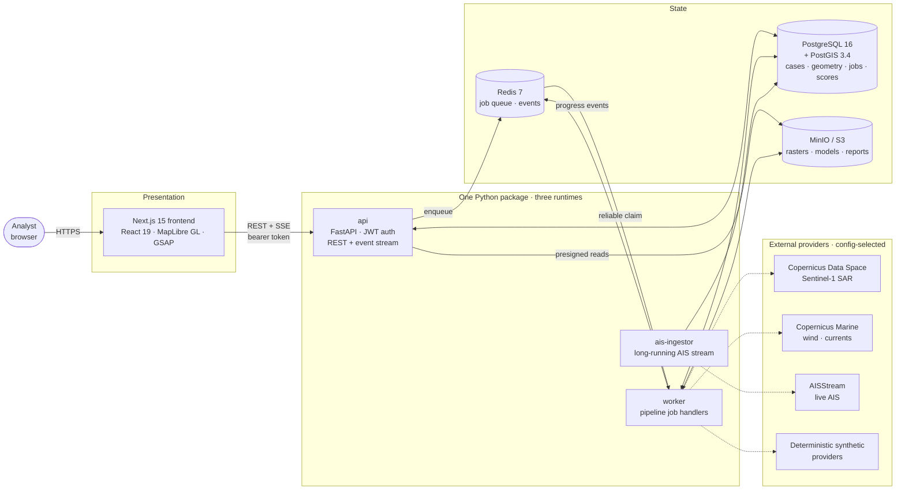
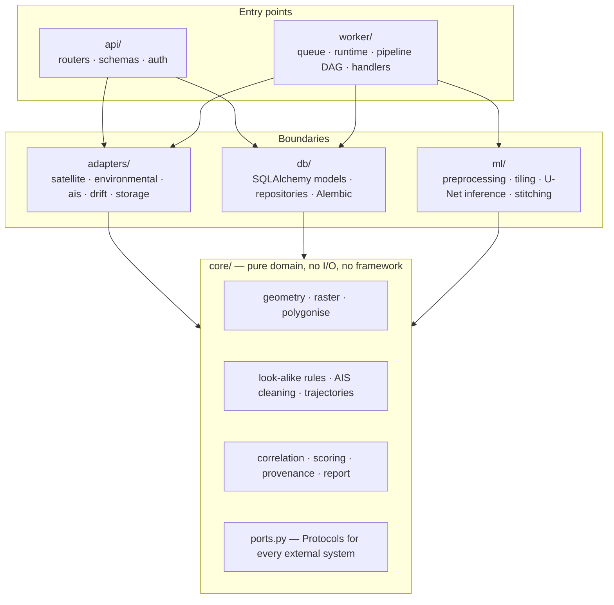
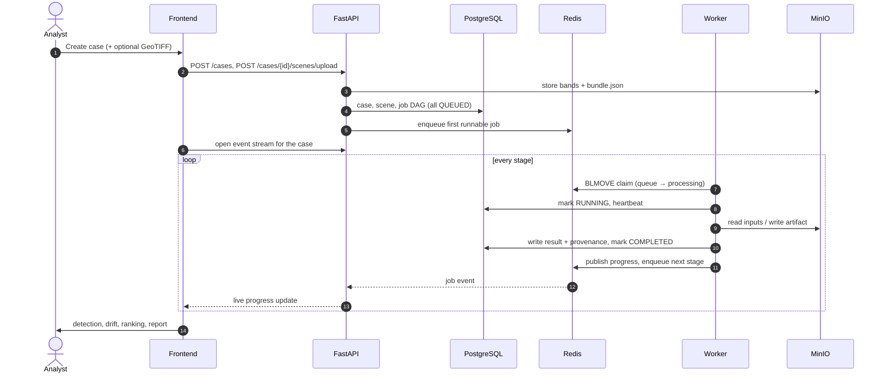
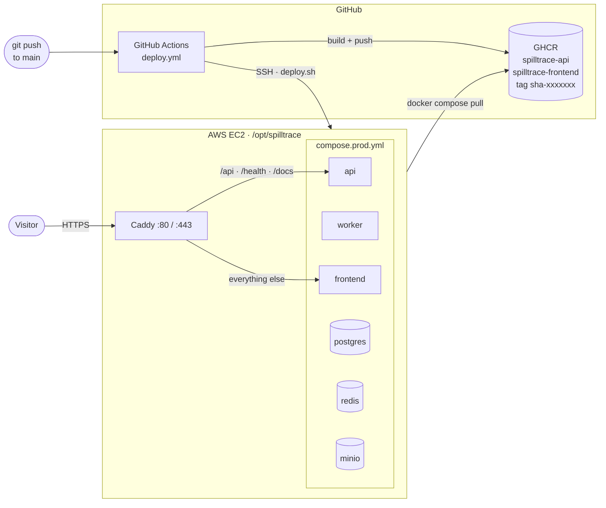

# SPILLTRACE — Maritime Oil-Spill Attribution System

**SIH26143 · Smart India Hackathon 2026 · Team OnlyBans · Team ID 6969**

SPILLTRACE helps an analyst investigate a suspected oil spill at sea. It finds oil-like
slicks in Sentinel-1 radar imagery with a trained U-Net, checks each one against the natural
phenomena that look the same, back-tracks the oil through wind and current to the region
where the discharge plausibly happened, rebuilds the tracks of the ships that were there, and
ranks those ships with a score that can be read factor by factor.

> [!IMPORTANT]
> **Attribution produced by this system is investigative, probabilistic evidence. It is not
> automatic legal proof.** The nearest ship is not the guilty ship. A gap in AIS reporting is
> not evidence of wrongdoing. A score of 0.88 is not an 88 % legal probability. These rules are
> enforced in the code and asserted by tests, not only written here.

---

## Contents

1. [The problem](#1-the-problem)
2. [How an investigation works](#2-how-an-investigation-works)
3. [System architecture](#3-system-architecture)
4. [The pipeline, stage by stage](#4-the-pipeline-stage-by-stage)
5. [The trained model](#5-the-trained-model)
6. [Telling oil from look-alikes](#6-telling-oil-from-look-alikes)
7. [How vessels are scored](#7-how-vessels-are-scored)
8. [Honesty by construction](#8-honesty-by-construction)
9. [What the demonstration shows](#9-what-the-demonstration-shows)
10. [Implementation status](#10-implementation-status)
11. [Running it](#11-running-it)
12. [Deployment](#12-deployment)
13. [The user interface](#13-the-user-interface)
14. [Repository layout](#14-repository-layout)
15. [Technology](#15-technology)
16. [Quality gates](#16-quality-gates)
17. [Documentation](#17-documentation)

---

## 1. The problem

Ships discharge oily waste at sea — illegally, and usually at night, far from shore. Satellite
radar can see the resulting slick, but a slick seen from orbit says nothing about **who** left it.
By the time it is imaged it has drifted for hours with the wind and current, and the vessel that
released it has moved on.

Answering "which ship?" means joining four kinds of evidence that normally live in different
systems and different teams:

| Evidence | Source | What it contributes |
|---|---|---|
| **Radar imagery** | Sentinel-1 SAR (Copernicus) | *Where* the slick is now, and how big |
| **Wind and ocean current** | Copernicus Marine | *How* the oil moved since it was released |
| **Ship positions** | AIS broadcasts | *Which* vessels were where, and when |
| **Physics** | Reverse drift simulation | *Where and when* the oil plausibly entered the water |

SPILLTRACE joins them into one reasoning chain, keeps every intermediate result inspectable, and
stops short of the one step no model should take on its own: declaring someone responsible.

---

## 2. How an investigation works

An investigation is a **case**: an area of interest drawn on the map plus a time window. From
there the system runs a fixed chain of reasoning, where every step consumes the previous step's
output and writes its own inspectable result.



Four properties hold at every step:

- **Every stage is a tracked background job.** Nothing runs inside an HTTP request; the browser
  watches progress over a live event stream.
- **Every stage writes an artifact** — a raster, a polygon, a set of tracks, a score row — that can
  be opened and inspected on its own.
- **Every artifact records its provenance** (`REAL`, `SYNTHETIC` or `MIXED`) and a run manifest
  with software version, model version, provider parameters and random seed.
- **The origin is a region, never a coordinate.** Drift is uncertain, so the system says where the
  oil *plausibly* entered the water and never pretends to know the exact point.

---

## 3. System architecture

### 3.1 Runtime view



**The browser talks to exactly one backend: the SPILLTRACE API.** It never calls Copernicus or
AISStream, so no provider credential can ever reach the client bundle. Provider calls happen only
in the worker and ingestor, which read credentials from the environment. The only third-party
hosts the browser loads are basemap imagery tiles (Esri World Imagery, CARTO), and a
Content-Security-Policy pins exactly those.

### 3.2 Layered code: ports and adapters

The backend is a **single installable package** (`backend/src/spilltrace`) run by three
containers with different entrypoints. That removes code drift between the API and the workers
and gives the whole backend one dependency lockfile.



The dependency rule is enforced by a test: **`core` imports nothing from `adapters`, `db`, `api`
or `worker`.** The scoring model, the look-alike rules and the AIS cleaner are therefore plain
functions over plain data, unit-testable without a database, a network or a GPU.

Every external system sits behind a `Protocol` in `core/ports.py` with a real and a deterministic
implementation, selected by an environment variable:

| Port | Real implementation | Deterministic implementation | Variable |
|---|---|---|---|
| Satellite catalogue | `CdseCatalogue` (Copernicus Data Space) | `FixtureCatalogue` | `SPILLTRACE_SATELLITE_PROVIDER` |
| Environment | `CopernicusMarineProvider` | `SyntheticEnvironmentProvider` | `SPILLTRACE_ENVIRONMENT_PROVIDER` |
| AIS | `AISStreamProvider` (server-side WebSocket) | `SyntheticAISProvider` | `SPILLTRACE_AIS_PROVIDER` |
| Drift engine | *OpenOil — not yet implemented* | `AnalyticalDriftEngine` | `SPILLTRACE_DRIFT_ENGINE` |
| Segmentation | `UNetModel` (trained checkpoint) | `AnalyticalDetector` | registered model version |
| Object storage | `S3ObjectStore` (MinIO / S3) | `LocalObjectStore` | `SPILLTRACE_STORAGE_PROVIDER` |

### 3.3 How a job moves through the system

Jobs are durable. **PostgreSQL is the source of truth for a job; Redis is only the transport.**
A worker that crashes mid-job therefore never loses the job's history, and a restart resumes a
pipeline rather than restarting it.



`BLMOVE` atomically moves a job id onto a per-worker processing list, so a job is never lost
between "taken off the queue" and "finished". A reaper returns stale claims to the queue.

### 3.4 Where data lives

**PostGIS holds geometry and metadata. MinIO holds bytes.** Nothing larger than a polygon or a
small JSON document is stored in a table.

| In PostgreSQL + PostGIS | In MinIO (S3) |
|---|---|
| Cases, areas of interest, time windows | Sentinel-1 measurement bands (GeoTIFF) |
| Scene footprints and metadata | Preprocessed VV/VH stacks |
| Spill polygons, areas, confidence | Oil-probability and mask rasters |
| Verification results and per-rule evidence | Drift density grids |
| Drift runs, origin regions, discharge windows | Model checkpoints |
| AIS positions, vessels, trajectories | Evidence reports (HTML) |
| Attributions: all six factor scores | |
| Jobs, pipelines, users, audit trail | |

Every stored object is referenced by URI **and SHA-256 checksum**, so a report can prove which
exact bytes it was built from.

---

## 4. The pipeline, stage by stage

| # | Job | What it does | Produces |
|---|---|---|---|
| 1 | `scene.search` | Queries the Sentinel-1 catalogue for passes intersecting the area and window, ranks them by coverage then recency | Scene candidates |
| 2 | `scene.download` | Fetches one file per polarisation (VV, VH) and a bundle manifest | Measurement bands in object storage |
| — | *upload* | Alternative to 1–2: accepts a GeoTIFF, reads its units and CRS, reprojects to EPSG:4326 | Same state as a download |
| 3 | `sar.preprocess` | σ0 → dB (skipped when the file is already dB), per-scene 1–99 percentile clip, standardisation, valid-pixel mask | ML-ready 2-channel stack |
| 4 | `ml.detect` | Tiles the scene, runs the U-Net, blends tiles back with a cosine window, applies hysteresis thresholding and morphology, polygonises | Probability raster, spill polygon, area, confidence |
| 5 | `env.fetch` | Retrieves wind and surface-current fields for the event | Environmental run |
| 6 | `detect.verify` | Scores the slick against look-alikes using wind, shape and radar contrast | `VERIFIED` / `UNCERTAIN` / `FALSE_POSITIVE` + per-rule evidence |
| 7 | `drift.hindcast` | Releases particles from the slick and runs them *backwards* under the forcing, as an ensemble | Origin probability region + inferred discharge window |
| 8 | `ais.ingest` | Pulls AIS messages for the origin region and window | Raw positions (deduplicated on `mmsi, timestamp, source`) |
| 9 | `ais.clean` | Rejects duplicates, invalid coordinates and physically impossible jumps; flags gaps | Clean positions + quality flags |
| 10 | `traj.build` | Orders positions per vessel into LineStrings with gap statistics | Trajectories |
| 11 | `correlate` | Keeps only vessels that were within the search buffer of the origin region during the discharge window | Candidates + why each was included |
| 12 | `score` | Scores each candidate on six independent factors | Attributions, every factor stored separately |
| 13 | `report.build` | Packages artifacts, sources, model versions and limitations | Evidence report |

Stage 5 deliberately runs **before** stage 6, although the problem statement lists them the other
way round: wind is the single most useful physical test for telling oil from a look-alike, and
verification cannot use data that has not been retrieved yet.

A detection that finds nothing is a **result, not a failure**. "No slick above threshold" and "no
vessel passed through the region" are true, useful statements about the world, and the case says
so plainly instead of showing an error.

---

## 5. The trained model

| | |
|---|---|
| Architecture | U-Net with a ResNet-34 encoder (`segmentation_models_pytorch`), 24.4 M parameters |
| Input | 2 channels — VV and VH σ0 in dB — 256 × 256 pixels |
| Output | 1 channel, per-pixel oil probability |
| Training data | Trujillo-Acatitla *et al.* Sentinel-1 oil-spill dataset (Zenodo, Parts I & II subset) |
| Training | From scratch (no pretrained weights), Google Colab T4, best epoch 42 of 50 |
| Look-alike handling | Hard negatives weighted 2× during training |

**Validation metrics** (15 % of training images, best epoch):

| IoU | Dice | Precision | Recall |
|---:|---:|---:|---:|
| 0.725 | 0.841 | 0.769 | 0.928 |

> [!NOTE]
> These are **validation-split** numbers from the training run, not results on an independent
> held-out test set, so treat them as an upper bound. Public SAR oil-spill datasets are dominated by
> European waters and performance elsewhere is documented to degrade. The platform displays both
> caveats next to the metrics wherever the model is shown.

The checkpoint is loaded by a pure-PyTorch re-implementation of the network
(`backend/src/spilltrace/ml/resnet_unet.py`) that was verified **bit-exact** against the original
library, so the production image does not need `segmentation_models_pytorch`, `timm` or
`huggingface_hub`. If no checkpoint is registered, a deterministic analytical detector answers
instead and every detection it produces is labelled `SYNTHETIC`.

### Uploading imagery in dB

The training dataset publishes σ0 in **dB**; catalogue products carry it in **linear power**.
Converting a dB raster to dB a second time does not merely distort it — dB values are negative, so
every pixel falls below the validity floor and the scene comes back *empty*, which looks exactly
like "no oil found". Measured on a test raster:

| Path | Valid pixels |
|---|---|
| dB raster through the linear conversion | **0 of 65,536** |
| dB raster with the units read from the file | **65,536 of 65,536** |

So the upload reads the units off the pixel values (any negative value means dB), records the reason
it decided, and lets the analyst override it. See `docs/DECISIONS.md` AD-36.

---

## 6. Telling oil from look-alikes

Many dark patches on radar are not oil: low-wind areas, algal films, rain cells, upwelling. A
binary oil / not-oil answer would over-claim, so verification has **three** outcomes —
`VERIFIED`, `UNCERTAIN`, `FALSE_POSITIVE` — and reports the evidence for each rule.

| Rule | Physical basis |
|---|---|
| **Wind window** | Below ~2 m/s the sea is glassy and a dark patch means nothing; 2–4 m/s is where look-alikes peak; **4–10 m/s** is where SAR oil detection is reliable; above ~12 m/s only thick slicks survive |
| **Shape complexity** | Natural films tend to have convoluted, fractal-like edges; discharges are simpler |
| **Elongation** | A ship discharging while under way leaves a long, narrow track |
| **Area** | Implausibly small or huge patches are down-weighted |
| **Contrast** | Oil damps capillary waves strongly and produces a sharp backscatter drop |
| **VV/VH power ratio** | Polarimetric behaviour differs between mineral oil and biogenic films |
| **Border gradient** | Oil tends to have a sharp edge; low-wind areas fade gradually |

A rule that cannot be evaluated (for example, no wind data) says *"not evaluated"* rather than
silently contributing a zero. A `FALSE_POSITIVE` verdict stops the chain: no drift is run and no
ship is ranked for something that is not oil.

---

## 7. How vessels are scored

### 7.1 Who becomes a candidate

A vessel is only scored if it passes the **correlation gate**: at least one of its AIS positions
lies within the search buffer (default **5 km**) of the origin region, during the inferred
discharge window (default tolerance **± 2 hours**). Everyone else is excluded, and the exclusion
is recorded. The candidate list is **never padded** to reach a target count.

### 7.2 The six factors

Every candidate is scored 0–1 on six independent factors. Each factor is stored separately and
shown separately; the final score is their weighted sum.

| Factor | Weight | Question it answers |
|---|---:|---|
| **Origin proximity** | 0.35 | How close did the vessel come to the high-probability core of the origin region? |
| **Time match** | 0.20 | Was it there *during* the inferred discharge window? |
| **Trajectory match** | 0.15 | Does its path pass through the region, rather than clip an edge? |
| **Heading match** | 0.10 | Is its course consistent with the orientation of the slick? |
| **Speed match** | 0.10 | Was its speed consistent with a discharge while under way? |
| **AIS reliability** | 0.10 | How complete and consistent is its AIS record? Gaps *lower* this. |
| | **1.00** | |

The weights are validated to sum to 1.0 before any score is written, so a score can never be
computed on a different scale from the one its confidence band assumes.

### 7.3 Confidence bands

| Score | Band |
|---|---|
| below 0.45 | Low investigative signal |
| 0.45 – 0.80 | Moderate investigative signal |
| 0.80 and above | High investigative signal |

Bands are **capped** when the evidence does not discriminate. If several candidates share
effectively the same origin-proximity score, the origin region is consistent with all of them —
which is not the same as supporting any one — and every candidate is held at `MODERATE`. The ranking
page explains the cap in plain words.

### 7.4 Going dark is not rewarded

A vessel with a long AIS gap near the origin becomes **less** certain, not more suspicious. AIS
reliability falls, the final score falls, and the report states that a reporting gap is not
evidence of wrongdoing. See the demonstration below for a concrete case.

---

## 8. Honesty by construction

The system is built so that it cannot quietly overstate what it knows.

| Constraint | How it is enforced |
|---|---|
| **Synthetic data is always labelled** | Every artifact carries `data_provenance`; a case rolls up to `SYNTHETIC` or `MIXED` if any input was synthetic; synthetic vessels carry `(SYNTHETIC)` in their names |
| **Never "guilty", "culprit", "responsible", "proven", "suspect"** | A vocabulary test fails the build if any of these appear in user-facing copy |
| **Unknown is not zero** | A value that was not measured renders as "—", never as `0` |
| **Provenance is written out** | Sources, model versions and parameters appear as text in the report, not as an icon |
| **Red means system failure only** | Evidence is never coloured red; red is reserved for a broken job |
| **Reproducibility** | Every artifact stores a run manifest: software version, git SHA, model version, provider parameters, seed, input checksums |
| **Uploaded files are not vouched for** | An uploaded scene is `REAL` data, but its notes state the platform did not retrieve it and cannot verify its origin |

---

## 9. What the demonstration shows

`make demo` runs the full chain on a deterministic scenario in the Gulf of Kutch
(`kutch-01`, seed 42) with **no external provider**. Only the *observations* are synthesised — a
scene, a slick, wind and current fields, and raw AIS messages that deliberately include
duplicates, an impossible position jump and reporting gaps. Every step after that runs the real
algorithm.

| | Result |
|---|---|
| Detection | 85.3 km² slick, valid MultiPolygon |
| Reverse drift | Origin region 522 km², inferred discharge window 4.8 h |
| Candidates | 6 vessels ranked |

```
rank  vessel              FINAL   origin  time   traj   head   speed  AIS    closest
 1    SAGAR PRABHA        0.9546  0.960   1.000  1.000  0.877  0.989  0.820  0.00 km
 2    GULF TRADER         0.9337  0.960   1.000  1.000  0.668  0.989  0.820  0.00 km
 3    EASTERN ORCHID      0.9274  0.960   1.000  1.000  0.753  0.885  0.776  0.00 km
 4    MATSYA VII          0.8885  0.960   1.000  1.000  0.587  0.990  0.448  0.00 km
 5    SAGAR HALCYON       0.6950  0.588   1.000  0.392  0.495  0.989  0.820  0.50 km
 6    ATLANTIC MERIDIAN   0.6860  0.525   1.000  0.350  0.752  0.929  0.817  3.35 km
```

**Look at rank 4.** MATSYA VII passed through the origin region with a perfect time and trajectory
match — and still ranks below three other ships, because a long reporting gap drops its AIS
reliability to 0.448. The system becomes *less* confident about a vessel that went dark; it does
not treat silence as a confession.

### Running the chain on your own image

Attach a Sentinel-1 GeoTIFF on **New case** and the chain starts directly on those pixels — no
catalogue search, no download. Verified end to end with a dual-band dB tile over the Gulf of Kutch:
the U-Net segmented a 368 km² slick, correlation found candidates among the vessels in the area, and
the ranking page listed them with all six factors.

> [!TIP]
> **Use a short case window — "Last 24 hours".** The synthetic AIS provider generates each vessel as
> a track spanning the whole window, so over several days every vessel has sailed far from the
> origin by the time of the discharge window, and correlation correctly finds nobody. Widening the
> search radius does not fix this and is not an honest way to produce candidates.

---

## 10. Implementation status

Mapped against the 20 functional requirements in [docs/REQUIREMENTS.md](docs/REQUIREMENTS.md),
verified against the running system rather than the documents.

| Requirement | Status | Notes |
|---|:---:|---|
| FR-001 Case with area + time window | ✅ | |
| FR-002 Sentinel-1 catalogue search | ✅ | Live against Copernicus Data Space |
| FR-003 Scene download + storage | ✅ | Plus GeoTIFF upload |
| FR-004 SAR preprocessing | ✅ | Handles linear and dB input |
| FR-005 U-Net inference | ✅ | Trained ResNet-34 U-Net, active |
| FR-006 Polygonisation | ✅ | |
| FR-007 Look-alike verification | ✅ | 7 rules, three outcomes |
| FR-008 Wind + ocean current | ⚠️ | Adapter written; the `copernicusmarine` library is not in the image, so **synthetic** fields are used |
| FR-009 Reverse drift | ⚠️ | Analytical ensemble engine works; **OpenDrift/OpenOil is not implemented** |
| FR-010 Origin probability region | ✅ | |
| FR-011 AIS ingestion | ⚠️ | AISStream adapter works, but the feed carries **no coverage of Indian waters** (measured: 0 positions); synthetic AIS is used |
| FR-012 AIS cleaning | ✅ | |
| FR-013 Trajectories | ✅ | |
| FR-014 Correlation | ✅ | |
| FR-015 Six-factor scoring | ✅ | |
| FR-016 Ranking with reasons | ✅ | |
| FR-017 Investigation dashboard | ✅ | |
| FR-018 Evidence report | ⚠️ | HTML ✅; **PDF export needs `weasyprint`**, which is not installed, so it falls back to HTML |
| FR-019 Tracked background jobs | ✅ | |
| FR-020 Provider-free demo chain | ✅ | |

**15 complete, 5 partial.** In all four partial cases the code path exists and runs — what is
missing is either a data source that carries no data for this region (AISStream), a library that
has not been installed in the image (Copernicus Marine, WeasyPrint), or, for drift, the OpenOil
adapter itself. Measurements and reasoning for each are in [docs/DECISIONS.md](docs/DECISIONS.md)
(AD-35 for AIS coverage, AD-36 for uploads).

---

## 11. Running it

**Requirements:** Docker or Podman with Compose, about 8 GB of RAM, and `make`.

```bash
make init-env      # create .env with generated secrets
make up            # start the whole stack
make migrate       # apply database migrations
make seed          # create the initial users and reference data
make demo          # build a fully synthetic demonstration case
```

| | |
|---|---|
| Frontend | http://localhost:3000 |
| API documentation | http://localhost:8000/docs |
| MinIO console | http://localhost:9001 |

The `Makefile` detects whether Docker or Podman is available. To use live imagery, set
`SPILLTRACE_SATELLITE_PROVIDER=cdse` with Copernicus Data Space credentials in `.env`. Full
configuration is in [docs/DEPLOYMENT.md](docs/DEPLOYMENT.md).

### Local containers

| Service | Role |
|---|---|
| `postgres` | PostgreSQL 16 + PostGIS 3.4 |
| `redis` | Job queue and event transport |
| `minio` + `minio-init` | S3-compatible object storage, bucket bootstrap |
| `api` | FastAPI on port 8000 |
| `worker` | Pipeline job handlers |
| `ais-ingestor` | Long-running AIS stream consumer |
| `frontend` | Next.js on port 3000 |

---

## 12. Deployment

The hosted instance runs on a single AWS EC2 host. Every push to `main` builds images and rolls
them out.



Caddy puts the frontend and the API behind **one origin**. That matters for two reasons: the API
base URL is baked into the frontend at build time, and the refresh-token cookie is only sent to the
same site. Deployment files live in [`infra/deploy/`](infra/deploy) and the workflow in
[`.github/workflows/deploy.yml`](.github/workflows/deploy.yml).

---

## 13. The user interface

Every screen opens with a short *"What am I looking at?"* panel written in plain language, so
the interface explains itself to someone seeing it for the first time.

| Screen | Purpose |
|---|---|
| **Dashboard** | Case counts, recent activity, system health |
| **Situational map** | Every case, slick, origin region and vessel on satellite imagery, with a globe view |
| **Cases** · **New case** | Case list; draw an area, choose a window, optionally attach a GeoTIFF |
| **Case** → Map | Area, slick, origin region and vessel tracks on one map with a timeline |
| **Case** → Spill details | Detection polygon, probability, look-alike verdict and per-rule evidence |
| **Case** → Drift & origin | Animated particle back-tracking, origin region, discharge window |
| **Case** → Vessel ranking | Candidates with all six factors and the arithmetic behind each total |
| **Case** → Evidence report | The packaged report with sources, versions and limitations |
| **Case** → Walkthrough | The whole investigation told as an eight-step story from live case data |
| **Compare cases** | Two cases side by side |
| **Vessel registry** | Every vessel seen, with its AIS history |
| **Activity feed** | Job and case events as they happen |
| **Analytics** | Aggregate views across cases |
| **ML Ops** *(admin)* | Registered model versions and their metrics |
| **System status** *(admin)* | Which providers are real or synthetic, service health |
| **Transparency** · **Help** | What the system can and cannot conclude; how to read each screen |

Two roles exist: **analysts** run investigations; **admins** additionally manage users, models and
system configuration.

---

## 14. Repository layout

```
backend/                 one Python package, three runtimes (api | worker | ais-ingestor)
  src/spilltrace/
    core/                pure domain: geometry, scoring, AIS cleaning, look-alike rules,
                         correlation, provenance, report — no I/O, no framework
    adapters/            every external boundary behind a Protocol
      satellite/         Copernicus Data Space · fixture · scene bundles
      environmental/     Copernicus Marine · synthetic
      ais/               AISStream · synthetic
      drift/             analytical ensemble engine
      storage/           S3 / MinIO · local
    ml/                  preprocessing, tiling, ResNet-34 U-Net, inference, stitching
    db/                  SQLAlchemy 2.0 models, repositories, Alembic migrations
    api/                 FastAPI routers, schemas, authentication
    worker/              job queue, runtime, pipeline DAG, stage handlers
    demo/                deterministic synthetic scenarios
  tests/                 unit and integration tests
frontend/                Next.js 15 · React 19 · TypeScript · MapLibre GL
  src/app/               routes (see section 13)
  src/components/        map, UI kit, motion, explanations
  src/lib/               API client, hooks, map styles, plain-language dictionary
ml/                      U-Net training scripts and dataset tooling
infra/                   Dockerfiles, database bootstrap, deployment
docs/                    requirements, architecture, decisions, pipelines, audit
```

---

## 15. Technology

| Layer | Stack |
|---|---|
| Frontend | Next.js 15 · React 19 · TypeScript 5 · MapLibre GL 5 · GSAP · Lenis · CSS Modules |
| Maps | Esri World Imagery and Ocean, CARTO basemaps, globe projection |
| API | FastAPI · Pydantic v2 · JWT with httpOnly refresh cookie · Server-Sent Events |
| Data | PostgreSQL 16 · PostGIS 3.4 · SQLAlchemy 2.0 (async) · Alembic |
| Queue | Redis 7 with a reliable-claim queue (`BLMOVE`, heartbeat, reaper) |
| Storage | MinIO (S3-compatible) |
| Geospatial | rasterio · shapely 2 · pyproj · GDAL |
| Machine learning | PyTorch · ResNet-34 U-Net |
| Infrastructure | Docker / Podman · GitHub Actions · GHCR · Caddy · AWS EC2 |

---

## 16. Quality gates

```bash
make quality-gate    # ruff, mypy, pytest, secret audit
```

| Suite | Result |
|---|---|
| Backend (pytest) | **647 passed** |
| Frontend (Vitest) | **165 passed** across 11 files |
| Lint | ruff clean |

The test suite includes the import-boundary rule for `core`, the banned-vocabulary check for
user-facing copy, and a failure-mode matrix that asserts empty results are reported as findings
rather than errors.

---

## 17. Documentation

| Document | Contents |
|---|---|
| [REQUIREMENTS.md](docs/REQUIREMENTS.md) | Every requirement from the problem statement, with a stable id |
| [ARCHITECTURE.md](docs/ARCHITECTURE.md) | System design in depth |
| [DECISIONS.md](docs/DECISIONS.md) | Researched technical decisions, each marked CONFIRMED or UNCERTAIN, with sources and measurements |
| [DATABASE.md](docs/DATABASE.md) | Full schema, indexes and representative spatial queries |
| [API.md](docs/API.md) | The HTTP contract |
| [ML_PIPELINE.md](docs/ML_PIPELINE.md) · [GIS_PIPELINE.md](docs/GIS_PIPELINE.md) · [AIS_PIPELINE.md](docs/AIS_PIPELINE.md) | Per-domain specifications with cited thresholds |
| [DESIGN_SYSTEM.md](docs/DESIGN_SYSTEM.md) | Interface rules, including the honesty constraints |
| [SECURITY.md](docs/SECURITY.md) | Security review, including known gaps |
| [TESTING.md](docs/TESTING.md) | Test strategy and failure-mode matrix |
| [DEPLOYMENT.md](docs/DEPLOYMENT.md) | Local setup, configuration and AWS hosting |
| [TRACEABILITY.md](docs/TRACEABILITY.md) | Requirement → code → test mapping |
| [FINAL_AUDIT.md](docs/FINAL_AUDIT.md) | Requirement-by-requirement verification |
| [user-guide.html](docs/user-guide.html) | Illustrated guide to every screen |

---

<sub>SPILLTRACE produces investigative leads for trained analysts. It does not determine legal
responsibility, and its output must be corroborated by independent evidence before any
enforcement action.</sub>
